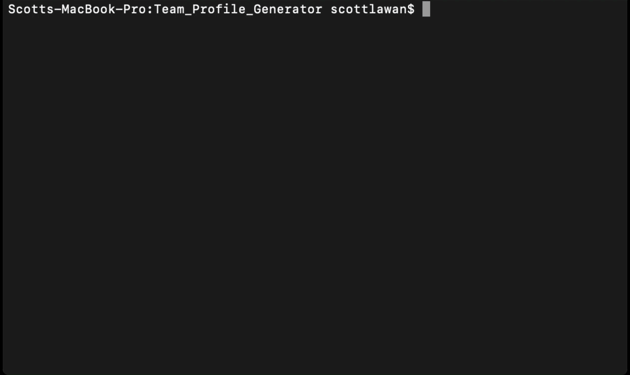

# Team Profile Generator


## Description
- A command-line application that takes in information about employees on a software engineering team, then generates an HTML webpage that displays summaries for each person

### The User Story for this project is as follows:
- AS A manager, I WANT to generate a webpage that displays my team's basic info, SO THAT I have quick access to their emails and GitHub profiles

### The codebase meets the following criteria for acceptance:
- WHEN I am prompted for my team members and their information, THEN an HTML file is generated that displays a nicely formatted team roster based on user input
- WHEN I click on an email address in the HTML, THEN my default email program opens and populates the TO field of the email with the address
- WHEN I click on the GitHub username, THEN that GitHub profile opens in a new tab
- WHEN I start the application, THEN I am prompted to enter the team manager’s name, employee ID, email address, and office number
- WHEN I enter the team manager’s name, employee ID, email address, and office number, THEN I am presented with a menu with the option to add an engineer or an intern or to finish building my team
- WHEN I select the engineer option, THEN I am prompted to enter the engineer’s name, ID, email, and GitHub username, and I am taken back to the menu
- WHEN I select the intern option, THEN I am prompted to enter the intern’s name, ID, email, and school, and I am taken back to the menu
- WHEN I decide to finish building my team, THEN I exit the application, and the HTML is generated

### Installation
- The project is uploaded to [GitHub](https://github.com/) at the following repository: [here](https://github.com/sourslaw/Team_Profile_Generator)

### Usage


- The application is invoked via the following command:  
	-	```bash
		node index.js
		```
- The interface will prompt the user with questions pertaining to the composition of their team, then output an HTML file titled, *generatedTEAM* into the 'dist' directory
	- The HTML file is linked to an existing CSS file with appropriate brand styling

### Tests


- The application uses Jest as the testing framework
- The tests can be invoked via the following command:  
	-	```bash
		npm test
		```

### Credits
- [Bootstrap](https://getbootstrap.com/)
- [Inquirer.js](https://www.npmjs.com/package/inquirer)
- [Jest](https://jestjs.io/)

### License
- Licensed under the [MIT](https://opensource.org/licenses/mit-license.php) license.